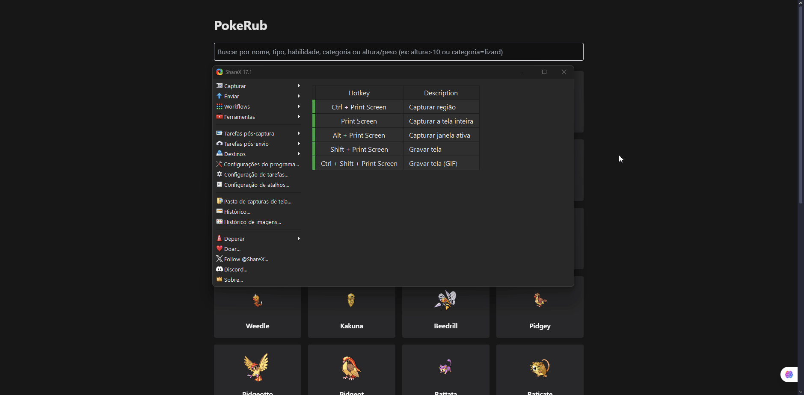

# PokeRub & RMWeb - Exercícios Web

## Exercícios realizados

Escolhi fazer os dois exercícios (PokeRub e RMWeb) pois quis mostrar versatilidade e dominar o consumo de APIs REST externas com React + TypeScript.

## Tecnologias

- Vite + React + TypeScript
- Consumo das APIs públicas: PokeAPI e Rick and Morty API
- Estilização básica e funcional para foco na usabilidade utilizando TailwindCSS

## Como rodar a aplicação

### Requisitos

- Node.js (versão 24.2.0)
- npm (versão 11.4.2)

### Passos para rodar

1. Clone o repositório  
2. Entre na pasta do projeto  
3. Rode `npm install` para instalar dependências  
4. Rode `npm run dev` para iniciar o servidor de desenvolvimento  
5. Abra `http://localhost:5173` (ou a porta que aparecer no console) no seu navegador

> **Nota:** A aplicação é totalmente frontend e consome APIs públicas. Não precisa de backend ou banco de dados local.

---

## Como testar

Não implementei testes automatizados, pois o foco foi entregar uma aplicação funcional e com boa UX dentro do prazo estipulado. Para testar, rode a aplicação e:

- Experimente a busca e filtro de pokémons/personagens  
- Visualize detalhes, evoluções (PokeRub), personagens (RMWeb) e episódios (RMWeb)  
- Salve itens favoritos e consulte a lista separada

---

## Evidências do produto final

Aqui seguem alguns gifs que mostram as funcionalidades principais.

  
  
  

---

## Observações do processo

- O desafio mais complexo foi o filtro no exercício RMWeb, onde precisei reestruturar a lógica para garantir boa experiência. Inicialmente tentei regex, mas migrei para filtros simples para evitar confusão do usuário.  
- Gerenciar estado para evolução de pokémons e lista de favoritos exigiu foco para manter a UI fluida.  
- Por ser um projeto frontend, achei importante focar na usabilidade e clareza, evitando complexidades desnecessárias.  

---

## Considerações finais

Gostei de trabalhar com React + TypeScript nesse desafio, principalmente consumindo APIs públicas e pensando em UX real para filtros e interações. Caso tivesse mais tempo, melhoraria a paginação pois apesar de ser fluida e não precisar clicar em botões de "Anterior" e "Próximo", seria interessante indicar o número da página que se encontra, adicionaria animações para deixar a experiência mais suave e atraente, e também, um favicon melhor para as aplicações.